# Rover System Architecture

This document describes the complete software architecture of the rover system, including all sensors, processing nodes, and control flow.

## System Overview

The rover system uses a dual-redundant sensor setup with sophisticated fusion algorithms for robust navigation and control. Key features include:

- **Dual GPS System**: SBG Ellipse-D (primary) and SparkFun ZED-F9P (secondary) with intelligent fusion
- **Dual Vision System**: Two ZED2i stereo cameras with point cloud merging for wide FOV
- **Multi-source Odometry**: Fusion of ZED2i VIO and SBG absolute positioning (cm-level precision)
- **Robust IMU**: Witmotion WT905 with custom heading processing
- **Pixhawk MCU**: Hardware interface for motor control
- **Full Nav2 Integration**: Complete navigation stack with recovery behaviors

---

## System Architecture Diagram

```mermaid
graph TB
    %% ============================================
    %% LAYER 1: INPUT DEVICES
    %% ============================================
    subgraph INPUT["INPUT LAYER"]
        Controller[Controller/Joystick]:::input
    end
    
    %% ============================================
    %% LAYER 2: SENSOR LAYER
    %% ============================================
    subgraph SENSORS["📡 SENSOR LAYER"]
        direction TB
        subgraph GPS_SENSORS["GPS Sensors"]
            SBGGPS[SBG Ellipse-D<br/>Primary GPS]:::sensor
            SparkFunGPS[SparkFun ZED-F9P<br/>Secondary GPS]:::sensor
        end
        
        subgraph VISION_SENSORS["Vision Sensors"]
            ZED1[ZED2i Camera 1<br/>Stereo + VIO]:::camera
            ZED2[ZED2i Camera 2<br/>Stereo + VIO]:::camera
        end
        
        subgraph IMU_SENSOR["IMU Sensor"]
            WitmotionIMU[Witmotion WT905<br/>9-Axis IMU]:::sensor
        end
    end
    
    %% ============================================
    %% LAYER 3: PERCEPTION & FUSION LAYER
    %% ============================================
    subgraph PERCEPTION["🔄 PERCEPTION & FUSION LAYER"]
        direction TB
        
        subgraph GPS_PROC["GPS Processing"]
            GPSFusion[GPS Fusion Node<br/>SV count, accuracy,<br/>covariance based]:::fusion
        end
        
        subgraph VISION_PROC["Vision Processing"]
            PCMerger[Point Cloud<br/>Merger Node]:::fusion
            WideFOV[Wide FOV<br/>Point Cloud]:::data
        end
        
        subgraph IMU_PROC["IMU Processing"]
            HeadingNode[Custom Heading Node]:::custom
        end
        
        subgraph ODOM_PROC["Odometry Processing"]
            ZEDVIO[ZED2i VIO]:::odom
            SBGPos[SBG Absolute Position<br/>cm-level precision]:::odom
            OdomFusion[Odometry Fusion Node]:::fusion
        end
    end
    
    %% ============================================
    %% LAYER 4: LOCALIZATION LAYER
    %% ============================================
    subgraph LOCALIZATION["🌍 LOCALIZATION LAYER"]
        RobotLoc[Robot Localization<br/>EKF/UKF]:::localization
        TF[TF Tree<br/>map→odom→base_link]:::core
    end
    
    %% ============================================
    %% LAYER 5: CONTROL INPUT PROCESSING
    %% ============================================
    subgraph CONTROL_INPUT["🎛️ CONTROL INPUT PROCESSING"]
        JoyNode[ROS2 Joy Node]:::ros2
        ControlNode[Custom Control Node]:::custom
    end
    
    %% ============================================
    %% LAYER 6: NAVIGATION LAYER
    %% ============================================
    subgraph NAVIGATION["🗺️ NAVIGATION LAYER"]
        direction TB
        Costmap[Costmap 2D<br/>Obstacle Map]:::nav
        
        subgraph PLANNERS["Path Planning"]
            GlobalPlanner[Global Planner<br/>A*, Dijkstra]:::nav
            LocalPlanner[Local Planner<br/>DWB, TEB]:::nav
        end
        
        Recovery[Recovery Behaviors<br/>Rotate, Backup]:::nav
    end
    
    %% ============================================
    %% LAYER 7: COMMAND ARBITRATION
    %% ============================================
    subgraph COMMAND["⚡ COMMAND LAYER"]
        RoverNode[Rover Node<br/>cmd_vel subscriber<br/>Command Arbitrator]:::core
    end
    
    %% ============================================
    %% LAYER 8: HARDWARE INTERFACE
    %% ============================================
    subgraph HARDWARE["🔧 HARDWARE INTERFACE LAYER"]
        direction TB
        Pixhawk[Pixhawk MCU<br/>Flight Controller]:::hardware
        
        subgraph VEL_CONTROL["Velocity Control"]
            PIDController[PID Velocity Controller<br/>Kp, Ki, Kd tuning]:::pid
        end
    end
    
    %% ============================================
    %% LAYER 9: ACTUATOR LAYER
    %% ============================================
    subgraph ACTUATORS["⚙️ ACTUATOR LAYER"]
        direction LR
        MotorController[Motor Controller<br/>ESC]:::hardware
        Servos[Servos/Actuators<br/>Steering/Aux]:::output
    end
    
    %% ============================================
    %% LAYER 10: PHYSICAL LAYER
    %% ============================================
    subgraph PHYSICAL["🚗 PHYSICAL LAYER"]
        WheelMotors[Wheel Motors<br/>with Encoders]:::output
    end
    
    %% ============================================
    %% CONNECTIONS - SENSOR TO FUSION
    %% ============================================
    SBGGPS -->|NavSatFix| GPSFusion
    SparkFunGPS -->|NavSatFix| GPSFusion
    
    ZED1 -->|Point Cloud 1| PCMerger
    ZED2 -->|Point Cloud 2| PCMerger
    PCMerger --> WideFOV
    
    ZED1 -->|VIO| ZEDVIO
    SBGGPS -->|Position| SBGPos
    
    WitmotionIMU -->|IMU Data| HeadingNode
    
    %% ============================================
    %% CONNECTIONS - FUSION TO LOCALIZATION
    %% ============================================
    GPSFusion -->|Fused GPS| RobotLoc
    HeadingNode -->|Orientation| RobotLoc
    ZEDVIO -->|Visual Odom| OdomFusion
    SBGPos -->|GPS Odom| OdomFusion
    OdomFusion -->|Fused Odom| RobotLoc
    
    RobotLoc -->|Transforms| TF
    
    %% ============================================
    %% CONNECTIONS - CONTROL INPUT
    %% ============================================
    Controller -->|USB/Bluetooth| JoyNode
    JoyNode -->|/joy| ControlNode
    
    %% ============================================
    %% CONNECTIONS - NAVIGATION
    %% ============================================
    WideFOV -->|Obstacles| Costmap
    TF -->|Transforms| Costmap
    TF -->|Transforms| GlobalPlanner
    TF -->|Transforms| LocalPlanner
    
    Costmap -->|Cost Data| GlobalPlanner
    Costmap -->|Cost Data| LocalPlanner
    GlobalPlanner -->|Global Path| LocalPlanner
    
    %% ============================================
    %% CONNECTIONS - COMMAND ARBITRATION
    %% ============================================
    ControlNode -->|Manual cmd_vel| RoverNode
    LocalPlanner -->|Auto cmd_vel| RoverNode
    Recovery -->|Recovery cmd_vel| RoverNode
    
    %% ============================================
    %% CONNECTIONS - HARDWARE CONTROL
    %% ============================================
    RoverNode -->|Velocity Commands| Pixhawk
    Pixhawk -->|Target Velocity| PIDController
    PIDController -->|Motor Commands| MotorController
    Pixhawk -->|PWM| Servos
    
    MotorController -->|Power| WheelMotors
    
    %% ============================================
    %% FEEDBACK LOOPS
    %% ============================================
    WheelMotors -.->|Encoder Feedback| PIDController
    PIDController -.->|Actual Velocity| Pixhawk
    Pixhawk -.->|Status| RoverNode
    
    %% ============================================
    %% STYLING
    %% ============================================
    classDef input fill:#FFB84D,stroke:#FF8C00,stroke-width:3px,color:#000
    classDef ros2 fill:#87CEEB,stroke:#4682B4,stroke-width:2px,color:#000
    classDef custom fill:#FF6B9D,stroke:#C71585,stroke-width:2px,color:#fff
    classDef sensor fill:#87CEFA,stroke:#4169E1,stroke-width:2px,color:#000
    classDef fusion fill:#98D8C8,stroke:#2E8B57,stroke-width:3px,color:#000
    classDef camera fill:#B0E0E6,stroke:#5F9EA0,stroke-width:2px,color:#000
    classDef data fill:#E0FFFF,stroke:#00CED1,stroke-width:2px,color:#000
    classDef odom fill:#90EE90,stroke:#32CD32,stroke-width:2px,color:#000
    classDef localization fill:#98FB98,stroke:#228B22,stroke-width:4px,color:#000
    classDef nav fill:#DDA0DD,stroke:#BA55D3,stroke-width:2px,color:#000
    classDef core fill:#FFA07A,stroke:#FF4500,stroke-width:4px,color:#000
    classDef hardware fill:#D8BFD8,stroke:#8B008B,stroke-width:2px,color:#000
    classDef pid fill:#FFD700,stroke:#FFA500,stroke-width:3px,color:#000
    classDef output fill:#F0E68C,stroke:#DAA520,stroke-width:2px,color:#000
```

---

## Component Descriptions

### 🟠 Input & Control Layer
- **Controller/Joystick**: Physical input device for manual control
- **ROS2 Joy Node**: Standard ROS2 joystick driver publishing to `/joy` topic
- **Custom Control Node**: Interprets joy messages and publishes velocity commands to `/cmd_vel`

### 💙 Sensor Layer

#### GPS System (Dual Redundant)
- **SBG Ellipse-D**: Primary GPS/INS with RTK capability
- **SparkFun ZED-F9P**: Secondary GPS receiver for redundancy
- **GPS Fusion Node**: Intelligent fusion based on:
  - Satellite count (SV count)
  - Position accuracy metrics
  - Covariance matrix analysis

#### IMU System
- **Witmotion WT905**: 9-axis IMU providing acceleration, gyro, and magnetometer data
- **Custom Heading Node**: Processes IMU data for accurate heading estimation

#### Vision System (Dual Camera)
- **ZED2i Camera 1 & 2**: Stereo cameras providing:
  - RGB images
  - Depth maps
  - Point clouds
  - Visual-Inertial Odometry (VIO)
- **Point Cloud Merger Node**: Combines point clouds from both cameras for wide FOV coverage

### 💚 Fusion & Localization Layer
- **Odometry Fusion Node**: Combines:
  - ZED2i Visual-Inertial Odometry
  - SBG cm-level absolute positioning
- **Robot Localization (EKF/UKF)**: Multi-sensor fusion using Extended/Unscented Kalman Filter
  - Fuses GPS, IMU, and odometry data
  - Publishes to TF tree (`map→odom→base_link`)

### 💜 Navigation Stack
- **Costmap 2D**: Maintains obstacle map using merged point cloud
- **Global Planner**: Plans optimal path to goal
- **Local Planner**: Real-time trajectory planning and obstacle avoidance
- **Recovery Behaviors**: Handles stuck situations and navigation failures

### 🔴 Core System
- **TF Tree**: Coordinate frame transformations throughout the system
- **Rover Node**: Main control node subscribing to `/cmd_vel` and interfacing with Pixhawk

### 🟣 Hardware Interface
- **Pixhawk MCU**: Flight controller running PX4/ArduPilot firmware
- **PID Velocity Controller**: Closed-loop velocity control with:
  - Proportional (Kp): Responds to current error
  - Integral (Ki): Eliminates steady-state error
  - Derivative (Kd): Reduces overshoot and oscillation
  - Encoder feedback for actual velocity measurement
- **Motor Controller**: Electronic speed controllers (ESC) for motors

### 🟡 Outputs
- **Wheel Motors**: Drive motors with encoder feedback for closed-loop control
- **Servos/Actuators**: Steering or auxiliary actuators

---

## Key Topics

| Topic | Type | Description |
|-------|------|-------------|
| `/joy` | sensor_msgs/Joy | Joystick input data |
| `/cmd_vel` | geometry_msgs/Twist | Velocity commands |
| `/gps/fix` | sensor_msgs/NavSatFix | Fused GPS position |
| `/imu/data` | sensor_msgs/Imu | IMU measurements |
| `/point_cloud` | sensor_msgs/PointCloud2 | Merged wide FOV point cloud |
| `/odom` | nav_msgs/Odometry | Fused odometry |
| `/tf` | tf2_msgs/TFMessage | Transform tree |
| `/local_costmap` | nav_msgs/OccupancyGrid | Local obstacle map |
| `/global_costmap` | nav_msgs/OccupancyGrid | Global obstacle map |

---

## Data Flow Summary

### Control Flow Hierarchy (10 Layers)

1. **🎮 Input Layer**: Physical controller/joystick

2. **📡 Sensor Layer**: 
   - GPS: SBG Ellipse-D + SparkFun ZED-F9P
   - Vision: Dual ZED2i cameras
   - IMU: Witmotion WT905

3. **🔄 Perception & Fusion Layer**:
   - GPS Fusion (SV count, accuracy, covariance based)
   - Point Cloud Merger (wide FOV)
   - IMU Processing (custom heading)
   - Odometry Fusion (VIO + GPS absolute position)

4. **🌍 Localization Layer**:
   - Robot Localization (EKF/UKF)
   - TF Tree (map→odom→base_link)

5. **🎛️ Control Input Processing**:
   - ROS2 Joy Node
   - Custom Control Node

6. **🗺️ Navigation Layer**:
   - Costmap 2D
   - Global Planner (A*, Dijkstra)
   - Local Planner (DWB, TEB)
   - Recovery Behaviors

7. **⚡ Command Layer**:
   - Rover Node (command arbitrator)
   - Selects between manual, autonomous, and recovery commands

8. **🔧 Hardware Interface Layer**:
   - Pixhawk MCU
   - PID Velocity Controller (closed-loop control)

9. **⚙️ Actuator Layer**:
   - Motor Controllers (ESC)
   - Servos/Actuators

10. **🚗 Physical Layer**:
    - Wheel Motors with encoder feedback

### Primary Data Paths

1. **Manual Control Path**: 
   - Controller → Joy Node → Control Node → `/cmd_vel` → Rover Node → Pixhawk → PID Controller → Motors

2. **Autonomous Navigation Path**: 
   - Global Planner → Local Planner → `/cmd_vel` → Rover Node → Pixhawk → PID Controller → Motors

3. **Localization Path**: 
   - GPS Fusion + IMU + VIO → Odometry Fusion → Robot Localization → TF Tree

4. **Perception Path**: 
   - Dual ZED2i → Point Cloud Merger → Wide FOV Cloud → Costmap → Navigation Stack

5. **Feedback Path**: 
   - Motor Encoders → PID Controller → Pixhawk → Rover Node

---

## Notes

- **Redundancy**: Dual GPS and dual camera systems provide fault tolerance
- **Precision**: SBG Ellipse-D provides cm-level absolute positioning
- **Wide FOV**: Merged point clouds from two cameras eliminate blind spots
- **Robust Fusion**: Load balancing of GPS sources based on quality metrics
- **Real-time Performance**: All nodes designed for low-latency operation

---

*Generated: November 9, 2025*
